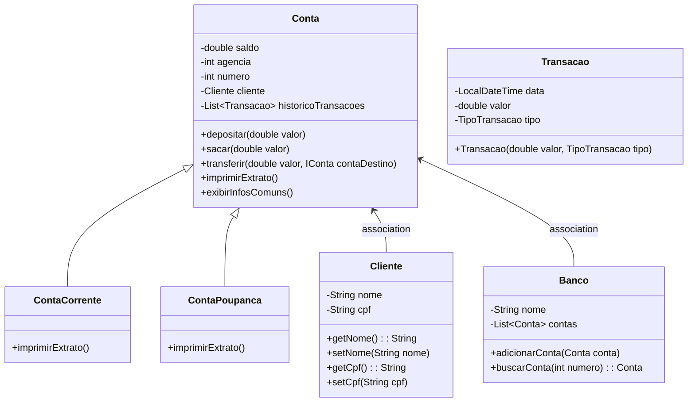

# Desafio Banco DIO

Este projeto é uma simulação de um sistema bancário simples, desenvolvido em Java, utilizando Lombok e Maven para gestão de dependências e redução de código boilerplate. O objetivo é fornecer uma base para a criação de funcionalidades bancárias, como contas correntes e poupança, transações e gestão de clientes.

## Funcionalidades

- Criação de contas correntes e poupança
- Depósitos, saques e transferências entre contas
- Histórico de transações
- Gestão de clientes e contas pelo banco

## Tecnologias Utilizadas

- Java
- Lombok
- Maven
- IntelliJ IDEA

## Estrutura do Projeto

```plaintext
src
├── main
│   ├── java
│   │   └── com
│   │       └── desafiobancodio
│   │           ├── Banco.java
│   │           ├── Cliente.java
│   │           ├── Conta.java
│   │           ├── ContaCorrente.java
│   │           ├── ContaPoupanca.java
│   │           ├── IConta.java
│   │           ├── Main.java
│   │           ├── SaldoInsuficienteException.java
│   │           ├── TipoConta.java
│   │           └── TipoTransacao.java
│   └── resources
└── test

```

## Diagrama de classes


## Instalação
1 - Clone o repositório:
`git clone https://github.com/chrissperb/desafio-banco-dio.git`

2 - Navegue até o diretório do projeto:
`cd desafio-banco-dio`

3 - Importe o projeto na sua IDE de preferência (recomendado: IntelliJ IDEA).

4 - Compile e execute o projeto utilizando as configurações do Maven.

## Como Usar
O ponto de entrada do programa é a classe Main. Você pode executar esta classe para ver exemplos de criação de contas, depósitos, saques e transferências. O código cria um cliente e duas contas (corrente e poupança), realiza algumas operações e imprime os extratos das contas.

## Contribuições
Sinta-se à vontade para contribuir com melhorias e novas funcionalidades. Para contribuir:
1 - Faça um fork deste repositório.

2 - Crie uma branch para sua feature/bugfix: `git checkout -b feature/nova-funcionalidade`

3 - Commit suas mudanças: `git commit -m 'Adiciona nova funcionalidade'`

4 - Envie para a branch original: `git push origin feature/nova-funcionalidade`

5 - Abra um Pull Request.


## Agradecimentos
Agradeço à DIO.me pelas orientações e desafio!
